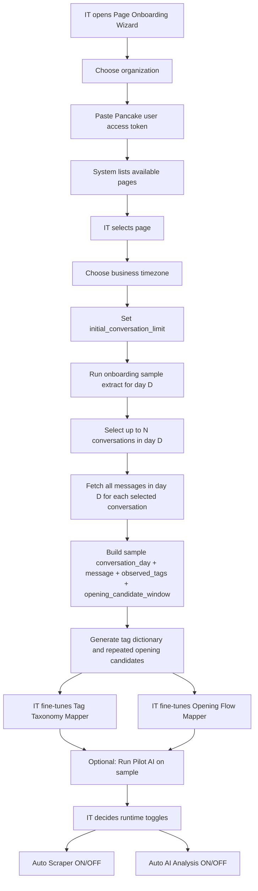
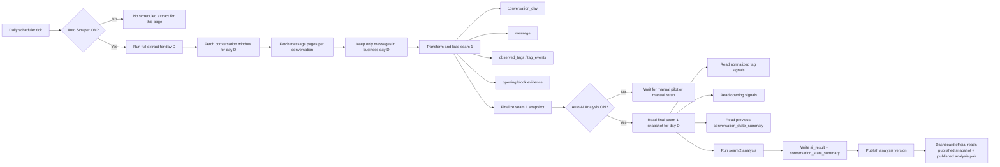
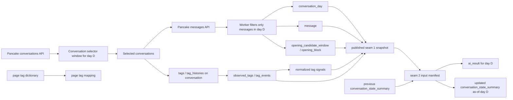
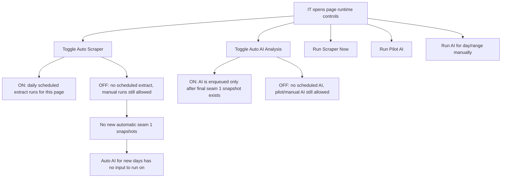
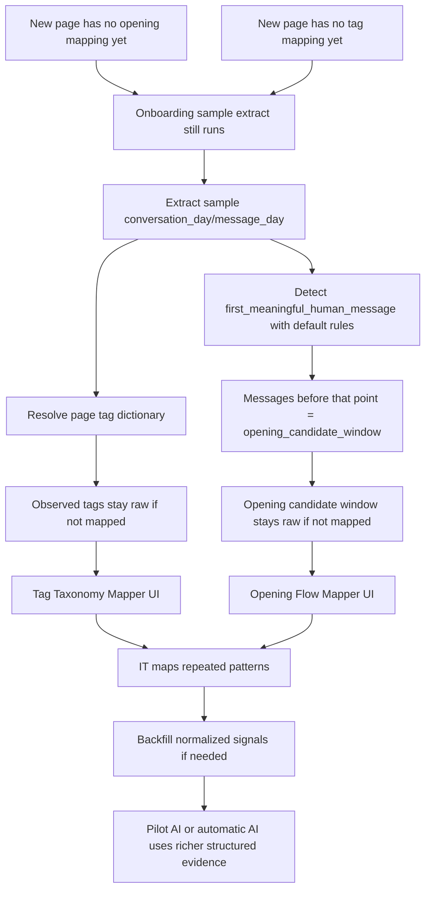
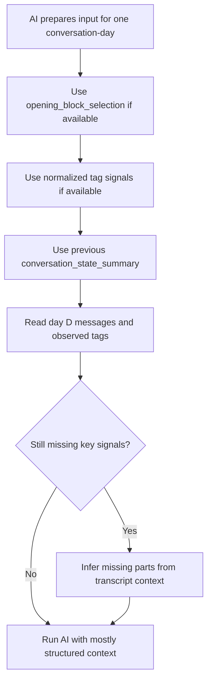
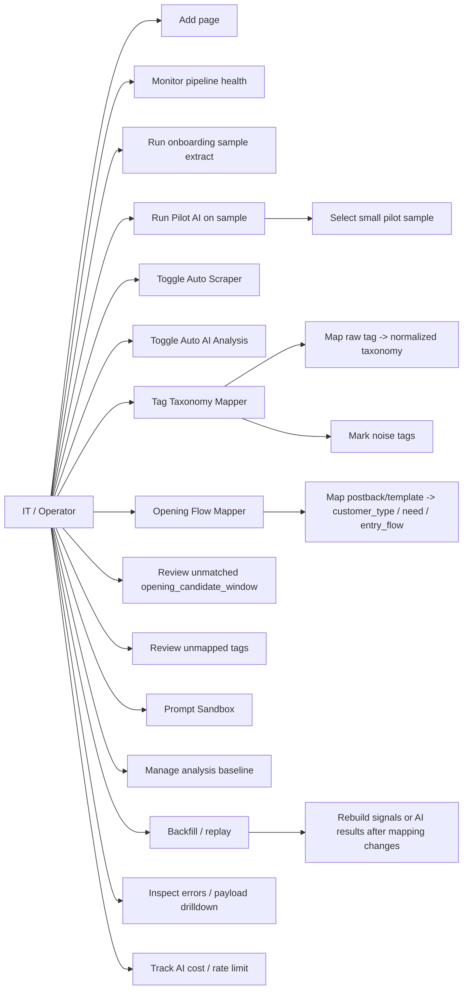
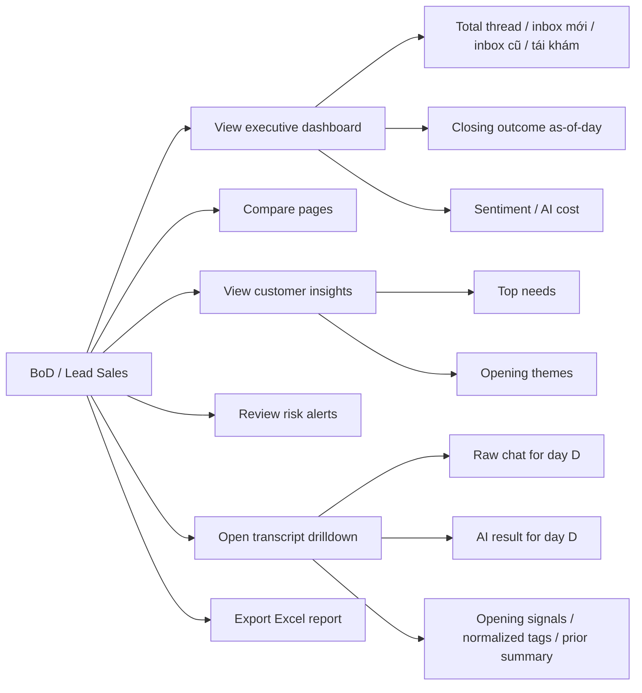
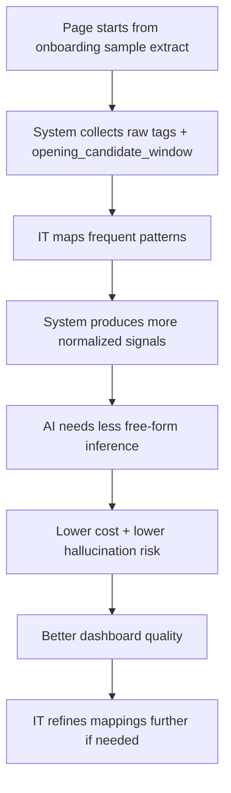

# Flow Charts

## Initial Page Onboarding

## Steady-State Automatic System Flow

## Data Flow For One Day

## Scheduler Controls

## New Page Without Mappings

## Evidence Priority For AI

## IT Use Cases

## Business Use Cases

## Mapping Improvement Loop

